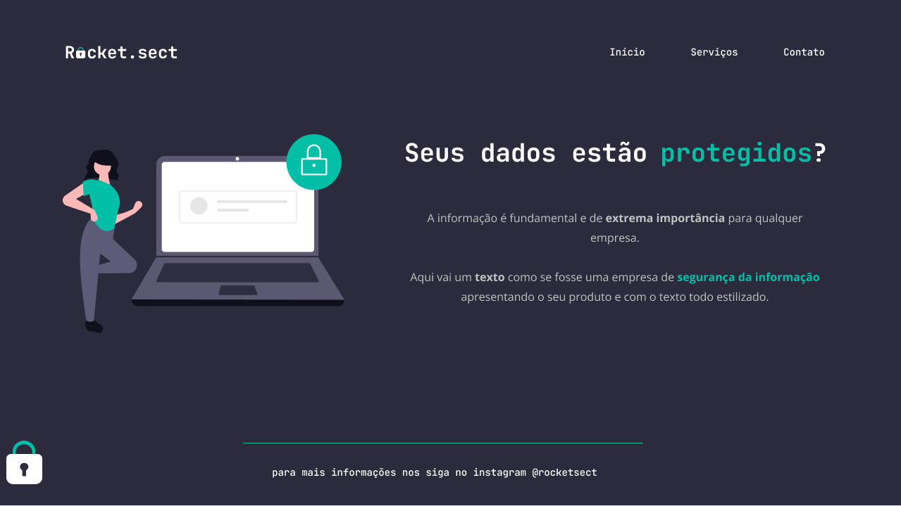

 

## 🚀 Tecnologias
Esse projeto foi desenvolvido com as seguintes tecnologias:

- HTML
- CSS
- Git e Github

## 🏷️ Layout
Você pode visualizar o layoout do projeto através
[desse link](https://www.figma.com/file/wRWWwMtM2K9qzPTVWVqSOW/Explorer-(Copy)?type=design&node-id=0-1&mode=design&t=hHaS31HNDHrY2zqd-0).
É necessário ter uma conta no [Figma](https://www.figma.com)